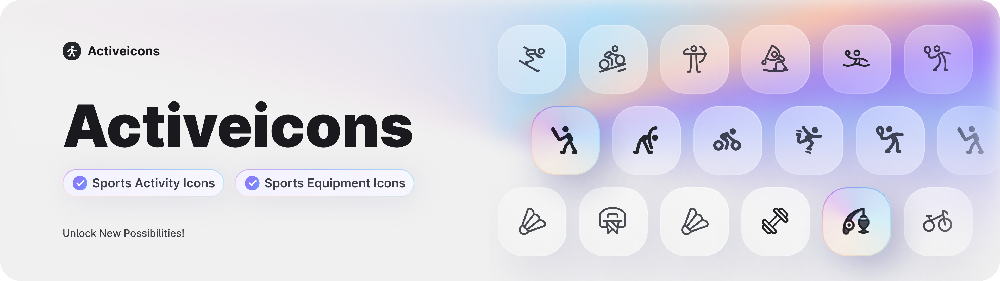

# Activeicons

**Activeicons | Sports Activity Icons and Sports Equipment Icons**

A dynamic icon collection featuring a wide range of sports activities and iconic sports equipment.

Ideal for websites, applications, and mobile design projects related to sports and fitness.

💜 Activeicons breathe life and energy into your designs, unlocking endless possibilities!

## Free Figma File

**⚡️ [Get free Figma file](https://www.figma.com/community/file/1379482746528273577/activeicons-sports-iconshttps:/)**

* Two Styles - Line, Filled, organized in Variants !
* Two Modes - Dark and Light !
* Support for Figma Variables.

## Support my work and get Activeicons PRO

**💥 [Get Activeicons Pro ](https://idealandia.lemonsqueezy.com/buy/57a7582e-8563-4917-a944-0ce27f87142b)**

**🌈 Seven Styles for you to choose from**

Line, Duoline, Broken, Filled, Bicolor, Duotone, Segmented

* Sports equipment icons are available in six styles.
* Sports activity icons are available in seven styles.

**🔥 Source Icons - separate layers**

The original icons are provided with separate layers, allowing you to make any modifications as needed.

**🌖 Dark or Light?**

All seven icon styles are also placed separately on their own pages in dark or light themes.   Bulk select the icons you want and convert them into components.
